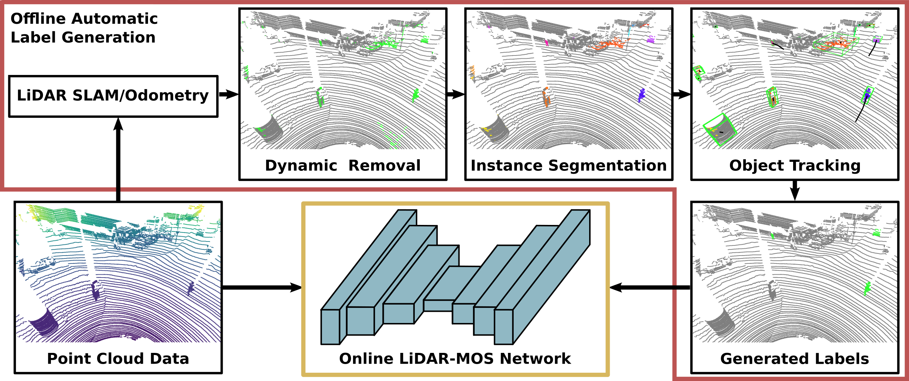

# Auto-MOS: Automatic Labeling to Generate Training Data for Online LiDAR-based Moving Object Segmentation

This repo contains the code for our Auto-MOS, which automatically generates training data for LiDAR-based moving objects segmentation [PDF](http://arxiv.org/pdf/2201.04501).

## Publication
If you use our implementation in your academic work, please cite the corresponding paper ([PDF](http://arxiv.org/pdf/2201.04501)):
    
	@article{chen2022arxiv,
		author = {X. Chen and B. Mersch and L. Nunes and R. Marcuzzi and I. Vizzo and J. Behley and C. Stachniss},
		title = {{Automatic Labeling to Generate Training Data for Online LiDAR-based Moving Object Segmentation}},
		journal = arxiv,
		year = 2022,
		eprint = {2201.04501},
		url = {http://arxiv.org/pdf/2201.04501},
		}
